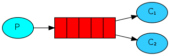
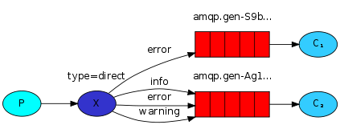

### Примеры работы с RabbitMQ 
[RabbitMQ Spring tutorial](https://habr.com/ru/post/262069/)

[Пример работы с RabbitMQ](http://spring-projects.ru/guides/messaging-rabbitmq/#scratch)

**1. direct** - простой обмен

**2. direct-json** - простой обмен разными JSON объектами

**3. work-queues** - В данном примере одну очередь слушают уже два листенера. Так можно распараллелить очередь на несколько компьютеров или нод в облаке.

**4. Publish-Subscribe** - Одно и то же сообщение приходит сразу двум консьюмерам.

**5. Routing** - используется routing key, в зависимости от которого сообщение может попасть в одну из очередей или сразу в обе.

